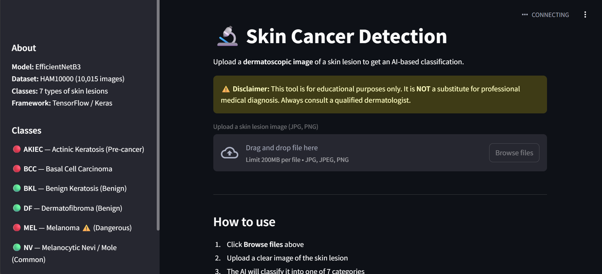
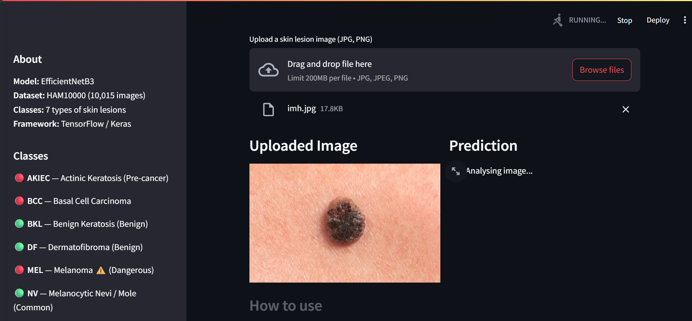
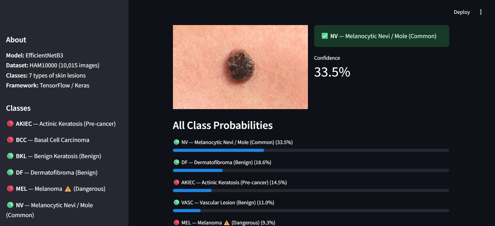

# 🩺 Skin Cancer Prediction Using Deep Learning

## 📌 Overview

Skin Cancer Prediction Using Deep Learning is an AI-powered web application that helps classify skin lesion images into different categories using a Convolutional Neural Network (CNN) model.

The application allows users to upload a dermoscopic skin image and receive an instant prediction along with confidence scores. The project combines Deep Learning, Computer Vision, and an interactive Streamlit interface to provide a simple and user-friendly diagnostic support tool.

---

## 🚀 Live Demo

Add your deployed application link here:

```text
https://your-app-link.onrender.com
```

---

## 📷 Application Screenshots

### 🏠 Home Page



---

### 📤 Image Upload



---

### 🎯 Prediction Result



---

## ✨ Features

* Upload skin lesion images
* Real-time prediction
* Deep Learning-based classification
* Confidence score visualization
* User-friendly Streamlit interface
* Fast and lightweight deployment
* Responsive web application

---

## 🧠 Model Information

### Model Architecture

* Transfer Learning Based CNN
* TensorFlow / Keras
* Image Classification Model

### Input

* Skin lesion image (.jpg, .jpeg, .png)

### Output

Predicted Skin Disease Category

Examples:

* Melanoma
* Basal Cell Carcinoma
* Benign Keratosis
* Melanocytic Nevi
* Vascular Lesions
* Actinic Keratosis
* Dermatofibroma

---

## 🛠️ Tech Stack

### Programming Language

* Python

### Deep Learning

* TensorFlow
* Keras

### Data Processing

* NumPy
* Pandas

### Visualization

* Matplotlib
* Seaborn
* Plotly

### Web Application

* Streamlit

### Version Control

* Git
* GitHub

---

## 📂 Project Structure

```text
Skin_Cancer_Prediction_Using_DeepLearning/
│
├── app/
│   └── app.py
│
├── models/
│   ├── best_model.h5
│   ├── class_info.json
│   └── confusion_matrix.png
│
├── notebooks/
│
├── src/
│
├── requirements.txt
│
├── README.md
│
└── .gitignore
```

---

## ⚙️ Installation

### Clone Repository

```bash
git clone https://github.com/vaibhavipatil0241/Skin_Cancer_Prediction_Using_DeepLearning.git

cd Skin_Cancer_Prediction_Using_DeepLearning
```

### Create Virtual Environment

```bash
python -m venv venv
```

### Activate Environment

#### Windows

```bash
venv\Scripts\activate
```

#### Linux / Mac

```bash
source venv/bin/activate
```

### Install Dependencies

```bash
pip install -r requirements.txt
```

---

## ▶️ Run Application

```bash
streamlit run app/app.py
```

Application will be available at:

```text
http://localhost:8501
```


### Evaluation Metrics

* Accuracy: Add Your Accuracy Here
* Precision: Add Precision Here
* Recall: Add Recall Here
* F1 Score: Add F1 Score Here

---

## 🔍 Workflow

1. User uploads a skin lesion image.
2. Image is preprocessed and resized.
3. CNN model extracts image features.
4. Model predicts the disease category.
5. Confidence score is displayed.
6. Result is shown through Streamlit UI.

---

## 🎯 Future Enhancements

* Multi-image prediction
* Explainable AI (Grad-CAM)
* Mobile application integration
* Doctor recommendation system
* Cloud deployment
* Prediction history tracking

---

## 🤝 Contributing

Contributions are welcome.

1. Fork the repository
2. Create a feature branch
3. Commit changes
4. Push to your branch
5. Create a Pull Request

---

## 👩‍💻 Author

**Vaibhavi Patil**

GitHub:
https://github.com/vaibhavipatil0241

